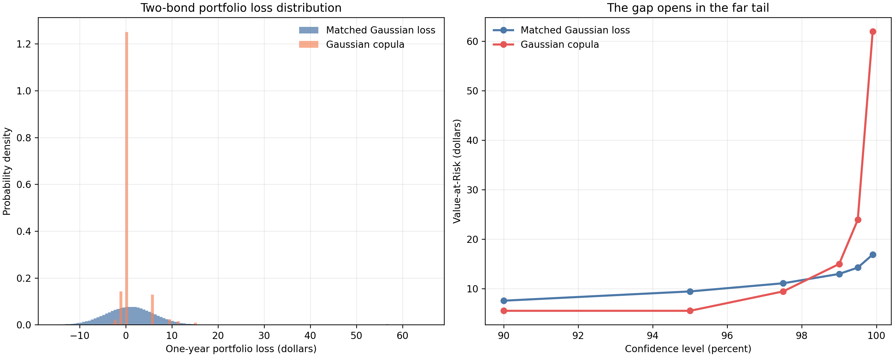
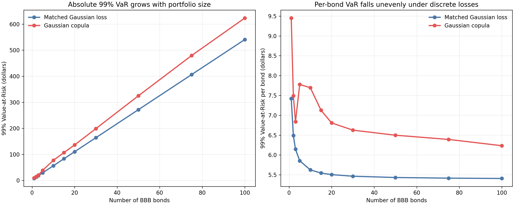

Un modèle de portefeuille peut estimer correctement la perte attendue tout en décrivant des pertes impossibles. Les migrations de crédit rendent ce défaut particulièrement visible. Sur un an, la plupart des obligations gardent leur notation. Quelques-unes sont dégradées et une fraction infime fait défaut. Remplacer ces résultats par une loi normale lisse conserve deux moments, mais efface les paliers entre les états.

J'ai étudié ce compromis sur un portefeuille volontairement réduit : deux obligations BBB identiques, valorisées chacune à \$107.55 aujourd'hui, avec une matrice de transition à un an. Le paramètre de dépendance commun est une corrélation latente des actifs de 0.5. Il ne s'agit ni de la corrélation observée des défauts ni de celle des pertes. Je compare une approximation gaussienne appliquée directement aux pertes à une copule gaussienne appliquée avant le passage de chaque obligation vers un état de notation discret.

Il ne s'agit pas d'une condamnation générale des modèles normaux. Les deux méthodes estiment la perte attendue du portefeuille à environ \$0.92, mais donnent respectivement \$16.88 et \$61.95 pour la Value-at-Risk, ou VaR, à 99.9%. La Value-at-Risk au niveau de confiance $q$ est le plus petit seuil de perte dont la probabilité de dépassement ne dépasse pas $1-q$. L'écart vient de la loi marginale des pertes, et non d'une prétendue dépendance à queues épaisses de la copule gaussienne.

## La table de migration définit la loi marginale

Pour chaque notation de fin d'année $k$, notons $p_k$ sa probabilité de transition, $V_k$ la valeur de l'obligation en dollars et $V_0=\$107.55$ la valeur BBB initiale. La perte correspondante, notée $\ell_k$, vaut

$$
\ell_k = V_0 - V_k.
$$

Une perte négative correspond à un gain. Une amélioration de BBB à AAA produit, par exemple, $107.55-109.37=-\$1.82$. Le défaut produit $107.55-51.13=\$56.42$.

| Notation en fin d'année | Probabilité $p_k$ | Valeur $V_k$ | Perte $\ell_k$ |
|:--|--:|--:|--:|
| AAA | 0.02% | \$109.37 | -\$1.82 |
| AA | 0.33% | \$109.19 | -\$1.64 |
| A | 5.95% | \$108.66 | -\$1.11 |
| BBB | 86.93% | \$107.55 | \$0.00 |
| BB | 5.30% | \$102.02 | \$5.53 |
| B | 1.17% | \$98.10 | \$9.45 |
| CCC | 0.12% | \$83.64 | \$23.91 |
| Défaut | 0.18% | \$51.13 | \$56.42 |

La perte attendue exacte d'un titre, notée $\mu$, est la moyenne des pertes par état pondérées par leur probabilité :

$$
\mu = \sum_{k=1}^{8} p_k\ell_k = \$0.462082.
$$

La variance exacte $\sigma^2$ et l'écart-type $\sigma$ se calculent en deux étapes :

$$
\sigma^2 = \sum_{k=1}^{8} p_k(\ell_k-\mu)^2,
$$

$$
\sigma = \sqrt{\sigma^2} = \$2.991784.
$$

Deux titres identiques ont donc une perte attendue de portefeuille égale à $2\mu=\$0.924164$, quelle que soit leur dépendance. Celle-ci modifie la distribution autour de la moyenne.

## Deux sens différents du mot gaussien

Les deux méthodes partent de variables normales standard latentes. Soit $N$ le nombre d'obligations, $R$ leur matrice de corrélation de dimension $N\times N$ et $\rho=0.5$ chaque terme hors diagonale. Ainsi, $R_{ii}=1$ et $R_{ij}=\rho$ lorsque $i\ne j$. Si $L$ est le facteur triangulaire inférieur de Cholesky tel que $LL^\mathsf{T}=R$, et si $\varepsilon$ est un vecteur de tirages normaux standard indépendants, alors

$$
Z=L\varepsilon
$$

a pour matrice de corrélation $R$. Les deux méthodes se séparent dans le traitement de $Z$.

Lorsque l'équicorrélation est positive, comme ici, la même construction s'écrit sous la forme d'un modèle à un facteur. Notons $M$ le facteur commun normal standard et $\varepsilon_i$ le choc normal standard indépendant propre au titre $i$. Alors

$$
Z_i=\sqrt{\rho}\,M+\sqrt{1-\rho}\,\varepsilon_i.
$$

La covariance de deux variables latentes distinctes se déduit directement :

$$
\operatorname{Cov}(Z_i,Z_j)
=\rho\operatorname{Var}(M)
=\rho, \qquad i\ne j.
$$

C'est le modèle homogène d'actifs à un facteur utilisé pour l'expérience sur la taille du portefeuille. Le mot "actif" désigne ici la variable de qualité de crédit non observée $Z_i$, pas le rendement en dollars de l'obligation.

### La méthode A lisse la perte elle-même

L'approximation gaussienne par moments transforme directement chaque valeur latente $Z_i$ de l'obligation $i$ en une perte continue $\widetilde{\ell}_i$ :

$$
\widetilde{\ell}_i = \mu + \sigma Z_i.
$$

La perte du portefeuille est la somme $\widetilde{L}_N=\sum_{i=1}^{N}\widetilde{\ell}_i$. Cette construction reproduit exactement la moyenne et la variance marginales. Elle attribue aussi une probabilité positive aux pertes situées entre deux migrations, aux pertes supérieures au défaut et aux gains importants absents de la table. Ce sont des conséquences mathématiques de l'approximation, pas des issues de notation possibles dans ce cadre.

```python
single_bond_losses = initial_bond_value - values
mean_loss_single = float(np.dot(probabilities, single_bond_losses))
var_loss_single = float(
    np.dot(probabilities, (single_bond_losses - mean_loss_single) ** 2)
)
losses_mvn = mean_loss_single + np.sqrt(var_loss_single) * z_correlated
credit_losses_mvn = losses_mvn.sum(axis=1)
```

### La méthode B conserve les paliers de notation

La copule gaussienne utilise le même type de variable latente $Z_i$, sans l'assimiler à une perte. Soit $\Phi$ la fonction de répartition de la loi normale standard. La transformation

$$
U_i=\Phi(Z_i)
$$

rend $U_i$ uniforme sur $(0,1)$. Définissons ensuite la probabilité de migration cumulée $C_k=\sum_{j=1}^{k}p_j$. L'état simulé $K_i$ est le premier dont le seuil cumulé contient $U_i$ :

$$
K_i=\min\{k:U_i\le C_k\}.
$$

L'obligation $i$ subit alors la perte $\ell_{K_i}$ de la table, et la perte du portefeuille vaut $L_N=\sum_{i=1}^{N}\ell_{K_i}$. La dépendance réside dans les variables gaussiennes latentes, tandis que chaque titre conserve sa distribution marginale à huit états.

```python
z_independent = np.random.randn(n_simulations, 2)
z_correlated = z_independent @ L.T
uniforms = norm.cdf(z_correlated)
rating_indices = np.searchsorted(cumulative_probs, uniforms, side="right")
bond_values = values[rating_indices]
credit_losses_copula = (initial_bond_value - bond_values).sum(axis=1)
```

Cette séparation compte. Une copule gaussienne a une dépendance asymptotique de queue nulle lorsque $|\rho|<1$. Les pertes sévères simulées ci-dessous viennent du passage des tirages latents corrélés vers une table de pertes très asymétrique, où le défaut coûte \$56.42, et non d'une dépendance gaussienne à queues épaisses.

### Dans quelle queue se trouve le défaut ?

Les états vont de AAA à Défaut, si bien que le défaut occupe la queue latente supérieure. Notons $p_D=0.0018$ la probabilité de défaut à un an et $a$ son seuil. Si $D_i$ est l'indicateur de défaut du titre $i$, alors

$$
a=\Phi^{-1}(1-p_D)=2.911238,
$$

$$
D_i=\mathbf{1}\{Z_i>a\}.
$$

Ici, $\mathbf{1}\{\cdot\}$ vaut un lorsque la condition est vraie et zéro sinon. Certains modèles de crédit placent le défaut sous $\Phi^{-1}(p_D)=-2.911238$. Remplacer chaque $Z_i$ par $-Z_i$ permet de passer d'une convention à l'autre sans modifier les probabilités conjointes. Le choix du signe est donc cohérent.

Le seuil montre aussi comment la corrélation latente se transforme en dépendance des défauts. Conditionnellement à $Z_1=z$, la seconde variable latente suit une loi normale de moyenne $\rho z$ et de variance $1-\rho^2$. Sa probabilité conditionnelle de défaut vaut

$$
\Pr(D_2=1\mid Z_1=z)
=1-\Phi\!\left(\frac{a-\rho z}{\sqrt{1-\rho^2}}\right).
$$

L'intégration sur les valeurs de $z$ qui placent le premier titre en défaut donne

$$
\Pr(D_2=1\mid D_1=1)
=\frac{1}{p_D}\int_a^\infty
\phi(z)\left[
1-\Phi\!\left(\frac{a-\rho z}{\sqrt{1-\rho^2}}\right)
\right]dz,
$$

où $\phi$ est la densité normale standard. Avec $\rho=0.5$, la probabilité de défaut conjoint est de $0.0121576\%$ et la probabilité conditionnelle de défaut de $6.7542\%$. La corrélation des indicateurs binaires de défaut reste très inférieure à 0.5 :

$$
\operatorname{Corr}(D_1,D_2)
=\frac{\Pr(D_1=1,D_2=1)-p_D^2}{p_D(1-p_D)}
=0.06586.
$$

## Le centre concorde, la queue diverge

J'ai effectué 1,000,000 simulations de deux obligations pour chaque méthode avec une graine aléatoire fixe. Une simulation de Monte Carlo consiste à tirer de nombreux scénarios aléatoires, puis à utiliser leur distribution empirique comme estimation. Les moyennes simulées se trouvent à moins de deux dixièmes de cent de la moyenne exacte du portefeuille, soit \$0.924164.

| Mesure | Pertes gaussiennes par moments | Copule gaussienne |
|:--|--:|--:|
| Perte moyenne | \$0.9231 | \$0.9226 |
| Perte médiane | \$0.9323 | \$0.0000 |
| Écart-type | \$5.1842 | \$4.6348 |
| Asymétrie | -0.0022 | 9.8819 |
| VaR à 95% | \$9.4416 | \$5.5300 |
| VaR à 99% | \$12.9736 | \$14.9800 |
| VaR à 99.9% | \$16.8841 | \$61.9500 |



Le panneau de gauche explique la médiane nulle de la copule : la probabilité qu'un titre reste BBB est de 86.93%, ce qui concentre une masse importante exactement à zéro. L'approximation gaussienne répartit cette masse entre de petits gains et de petites pertes. Au quantile de 95%, ce lissage est prudent, avec une VaR de \$9.44 contre \$5.53. Plus loin dans la queue, l'ordre s'inverse. Le modèle discret atteint des combinaisons de dégradation et de défaut auxquelles la mince queue de perte gaussienne accorde trop peu de poids.

Le saut de \$14.98 à 99% vers \$61.95 à 99.9% n'est pas un problème numérique. Le quantile d'une loi discrète peut rester constant, puis bondir lorsque le niveau de confiance franchit une combinaison d'états. Une seule VaR décrit donc mal le risque de crédit.

### Remplacer la simulation par un contrôle exact à deux titres

Deux titres et huit états ne donnent que $8\times8=64$ cellules conjointes. J'ai intégré chaque cellule à partir de la loi normale conditionnelle ci-dessus, puis regroupé les cellules qui aboutissent à la même perte de portefeuille. On obtient ainsi une référence déterministe pour la colonne de la copule.

| Mesure | Intégration exacte | 1,000,000 simulations | Simulation moins valeur exacte |
|:--|--:|--:|--:|
| Perte moyenne | \$0.924164 | \$0.922595 | -\$0.001569 |
| Écart-type | \$4.637548 | \$4.634776 | -\$0.002772 |
| VaR à 99% | \$14.980000 | \$14.980000 | \$0.000000 |
| VaR à 99.9% | \$61.950000 | \$61.950000 | \$0.000000 |
| Corrélation de Pearson des pertes | 0.201397 | 0.204393 | 0.002996 |

Les quantiles coïncident exactement pour cette graine, car chacun tombe sur un niveau de perte possible bien séparé. La corrélation converge plus lentement : la probabilité exacte de défaut conjoint ne produit qu'environ 122 doubles défauts sur 1,000,000 scénarios à deux titres. Des préfixes de 10,000, 100,000 et 1,000,000 simulations estiment la corrélation des pertes à 0.1600, 0.2002 et 0.2044. Une graine fixe rend le calcul reproductible, mais ne supprime pas l'erreur d'échantillonnage.

## La corrélation saisie n'est pas celle des pertes

Le paramètre $\rho=0.5$ décrit la corrélation des normales latentes. Dans la méthode A, une transformation affine relie $Z_i$ à la perte. La corrélation de Pearson simulée entre les pertes des deux titres reste donc à 0.5002. La corrélation de Pearson mesure la relation linéaire.

Dans la méthode B, les seuils modifient cette relation. L'intégration exacte donne une corrélation de Pearson de 0.2014 entre les pertes réalisées ; la simulation l'estime à 0.2044. Leur corrélation de rang de Spearman simulée vaut 0.2735. La corrélation de Spearman mesure si deux variables tendent à évoluer dans le même ordre de rang. Les ex aequo sont fréquents puisque les deux titres restent souvent BBB. Aucun de ces deux coefficients ne doit donc être égal au paramètre latent. La corrélation des pertes diffère aussi de la corrélation de 0.0659 des indicateurs de défaut, car elle tient compte de chaque migration et de sa perte en dollars.

Cet écart peut fausser une calibration. Fixer la corrélation latente à une corrélation historique entre pertes observées ne reproduit généralement pas la même valeur après application des seuils de notation. Il faut calibrer le paramètre à travers la couche de mesure du modèle.

## De un à cent titres

La seconde expérience conserve la même table BBB homogène et la même hypothèse d'équicorrélation pour des portefeuilles de 1 à 100 obligations. Chaque point de la copule repose sur 200,000 simulations. La courbe gaussienne par moments se calcule analytiquement. La variance et le quantile du portefeuille sont

$$
\operatorname{Var}(\widetilde L_N)
=\sigma^2\left[N+\rho N(N-1)\right],
$$

$$
\operatorname{VaR}_{q}(\widetilde L_N)
=N\mu+\Phi^{-1}(q)\sigma
\sqrt{N+\rho N(N-1)}.
$$

Le premier terme sous la racine rassemble les $N$ variances individuelles. Le second rassemble les $N(N-1)$ termes de covariance ordonnés. Pour chacun des deux modèles, la VaR au niveau $q$ vaut

$$
\operatorname{VaR}_{0.99}(L_N)=\inf\{x:\Pr(L_N\le x)\ge 0.99\}.
$$



La VaR absolue augmente avec le portefeuille. La VaR par obligation diminue parce que le risque de migration idiosyncratique se diversifie, mais le facteur latent commun l'empêche de tendre vers zéro. À 100 titres, le résultat gaussien analytique atteint \$540.80 et l'estimation par copule \$623.36, soit respectivement \$5.41 et \$6.23 par obligation.

La courbe de la copule est irrégulière pour les petits portefeuilles. C'est le comportement attendu lorsque la VaR est choisie parmi un ensemble fini de pertes possibles : l'ajout d'une obligation modifie à la fois les combinaisons d'états et la position du 99e percentile. Une règle d'échelle lisse masque cette granularité.

## Les limites de cette expérience

Cette comparaison contrôlée reste très loin d'un modèle de portefeuille de crédit prêt pour la production. Toutes les obligations sont identiques. La matrice de migration est statique, l'horizon est fixé à un an et chaque notation possède une valeur de fin d'année déterministe. L'incertitude du recouvrement, la variation des spreads au sein d'une notation, la concentration par émetteur, les facteurs sectoriels et l'erreur d'estimation sont absents.

L'hypothèse de dépendance est elle aussi étroite. Un seul paramètre d'équicorrélation impose la même relation latente à toutes les paires. Une copule gaussienne ne peut pas produire de dépendance asymptotique de queue non nulle, sauf en cas de corrélation parfaite. Une copule de Student $t$ pourrait ajouter cette dépendance, mais elle répondrait à une autre question et introduirait un paramètre de degrés de liberté à étayer par des données. La corrélation d'actifs de 0.5 est ici illustrative, pas calibrée. Un modèle de production devrait l'estimer par notation, secteur, région et horizon, puis tester sa sensibilité à l'erreur d'estimation et aux dépendances de crise.

Je ne choisirais pas ici une approximation lisse sur la seule base de ses moments ajustés. Les pertes proviennent de changements d'état rares et discrets. Il faut examiner les quantiles de part et d'autre du niveau de confiance ciblé et vérifier comment la dépendance latente devient une dépendance observée des pertes. L'approximation doit aussi respecter les pertes qui peuvent se produire.

## Reproduire les figures

Le script `blog/generate_charts.py` reprend la table de transition intégrée au projet, des graines fixes, 1,000,000 tirages pour les deux obligations et 200,000 tirages de copule pour chaque taille de portefeuille. Il enregistre les estimations, la référence exacte et le contrôle de convergence dans `blog/data/` avant de produire les deux figures. Les tests de `tests/test_model.py` vérifient à la main les moments marginaux, le signe du seuil, le cas indépendant, la conservation des lois marginales, les quantiles exacts de la queue et la variance gaussienne équicorrélée.

## Références

- David X. Li, [« On Default Correlation: A Copula Function Approach »](https://doi.org/10.2139/ssrn.187289), 2000. Il s'agit de l'article fondateur sur l'approche par copule de la corrélation des défauts associée à cette famille de modèles.
- Michael B. Gordy, [« A Risk-Factor Model Foundation for Ratings-Based Bank Capital Rules »](https://doi.org/10.1016/S1042-9573(03)00040-8), *Journal of Financial Intermediation*, 2003. Gordy établit le fondement asymptotique à un facteur des modèles de capital pour le risque de crédit en portefeuille.
- Comité de Bâle sur le contrôle bancaire, [*An Explanatory Note on the Basel II IRB Risk Weight Functions*](https://www.bis.org/bcbs/irbriskweight.pdf), 2005. La note définit la probabilité de défaut, la perte en cas de défaut, la maturité, l'exposition et la corrélation des actifs dans le cadre réglementaire à un facteur.
- SciPy, [référence de `scipy.integrate.quad`](https://docs.scipy.org/doc/scipy/reference/generated/scipy.integrate.quad.html). Le contrôle exact à deux titres utilise cette routine de quadrature adaptative pour les intégrales normales conditionnelles.
